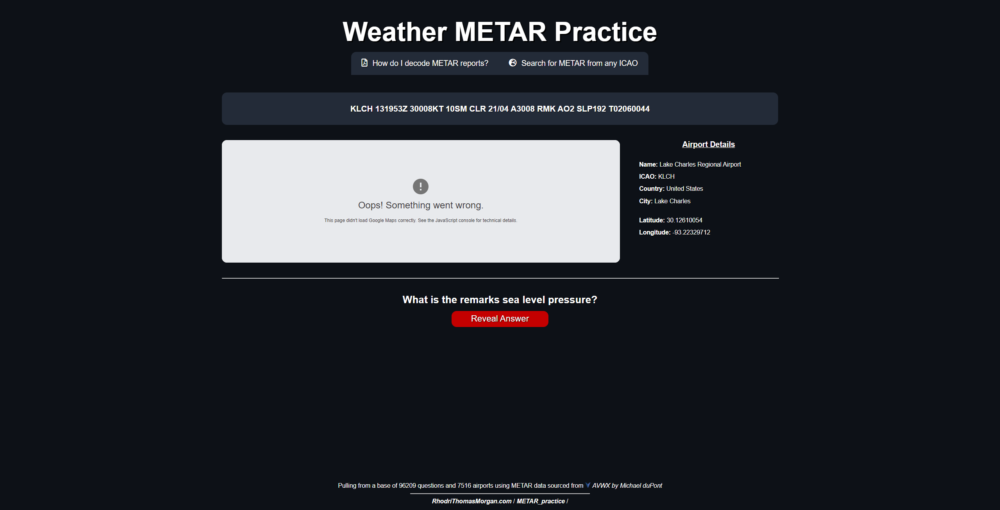

# METAR Practice Page

## About

https://user-images.githubusercontent.com/52254823/136636728-5bcc1d2c-b61f-42e1-8dd8-1bd0562a044a.mp4

### Accessing Application 

You can use the application by [visiting this link](https://www.rhodrithomasmorgan.com/METAR_practice/).

### Data Sources

For a list of airports I am using [Michael's 'ICAO Airport Codes' dataset.](https://www.kaggle.com/mike90/airport-codes)

For METAR data I am using [AVWX Aviation Weather REST API by Michael duPont.](https://avwx.rest/#)

Map of the location of airports is provided by [Google Maps Platform.](https://cloud.google.com/maps-platform)

## Python and Dependencies

### Python Version

This project is using `Python 3.7.0`.

### Dependencies
 
 The list of dependencies for this project can be found in `requirements.txt` and can be installed using `pip install -r requirements.txt`. To build a new `requirements.txt` delete the old version, navigate to directory and run `pip freeze > requirements.txt`.
 
 ## Running/Testing
 
 ### Running Site
 
 You can start running the site using `python manage.py runserver` which can then be viewed by visiting `127.0.0.1:8000`. With `DEBUG = True` in `rhodrithomasmorgan/settings.py` this will present the current urls available.
 
 To access the admin panel visit `127.0.0.1:8000/admin` and use the login credentials `username=test` and `password=password`. Alternatively you can create a super user using `python manage.py createsuperuser`.

`metar_practice/pull_metar_data.py` is a seperate script which should be ran in parallel for METAR data pulling. You can configure pull limits and question caps in this file.

`metar_practice/load_airports.py` is a script for inserting all airports into the database. It is a requirement.

 
 ### Testing Site
 
 You can run the testing suite using `python manage.py test`. Resulting errors will be show.

## Known Issues

### Google Maps Loading Locally

Running the site locally or on any other domain than [RhodriThomasMorgan.com](https://www.RhodriThomasMorgan.com) will throw the error shown below. 

This is due to the API being restricted to my domain. Ignore the error.
